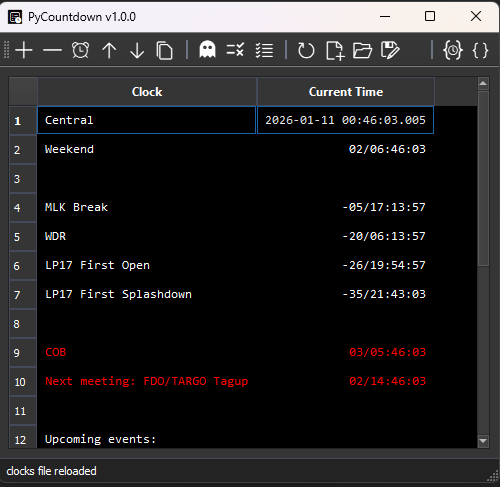
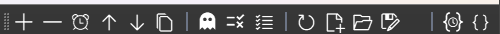
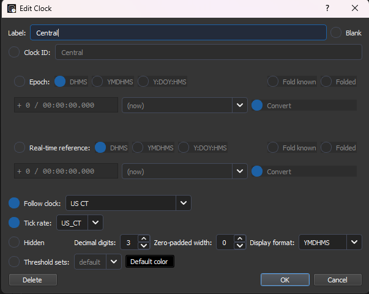
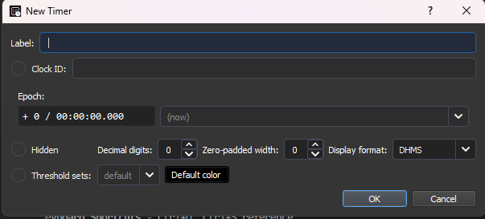
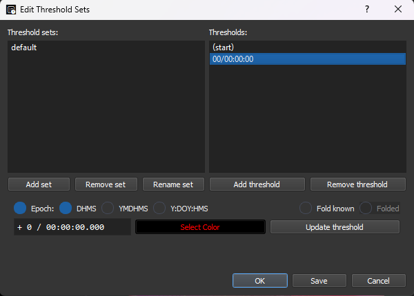
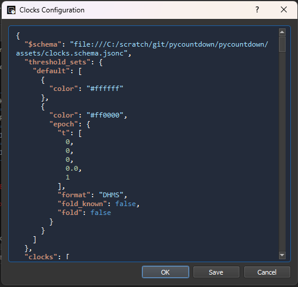
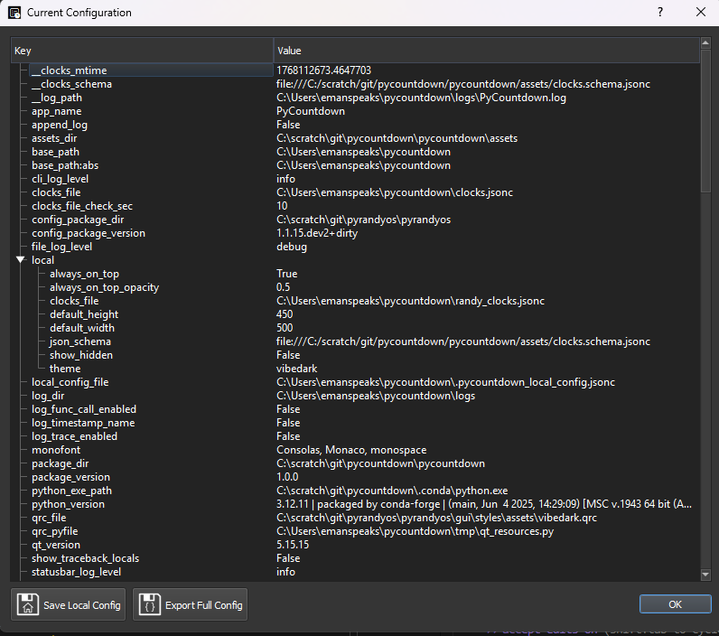
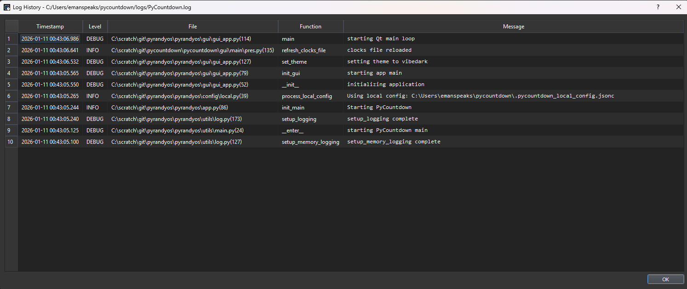

# PyCountdown User Manual

A comprehensive guide to using PyCountdown, a powerful countdown clock application for managing multiple customizable timers and clocks.

---

## Table of Contents

1. [Introduction](#introduction)
2. [Installation](#installation)
   - [Requirements](#requirements)
   - [Installing from PyPI](#installing-from-pypi)
   - [Installing from Source](#installing-from-source)
   - [Optional Dependencies](#optional-dependencies)
3. [Getting Started](#getting-started)
   - [Launching PyCountdown](#launching-pycountdown)
   - [First Steps](#first-steps)
4. [Main Interface](#main-interface)
   - [Toolbar](#toolbar)
   - [Clock Table](#clock-table)
     - [Selecting Clocks](#selecting-clocks)
     - [Editing Clocks](#editing-clocks)
5. [Working with Clocks](#working-with-clocks)
   - [Understanding Clock Types](#understanding-clock-types)
   - [Built-in Default Clocks](#built-in-default-clocks)
   - [Creating a New Clock](#creating-a-new-clock)
   - [Editing an Existing Clock](#editing-an-existing-clock)
   - [Removing Clocks](#removing-clocks)
   - [Reordering Clocks](#reordering-clocks)
   - [Duplicating Clocks](#duplicating-clocks)
6. [Epoch Widget](#epoch-widget)
   - [Input format](#input-format)
   - [Time fields](#time-fields)
     - [Value entry](#value-entry)
     - [Keyboard entry and navigation](#keyboard-entry-and-navigation)
     - [Increment/decrement](#incrementdecrement)
     - [DHMS Days](#dhms-days)
   - [Epoch reference clock](#epoch-reference-clock)
     - [Convert](#convert)
     - [(now) clock](#now-clock)
   - [Folds](#folds)
7. [Clock Editor](#clock-editor)
   - [Label and ID](#label-and-id)
   - [Epoch Settings](#epoch-settings)
   - [Real-time Reference](#real-time-reference)
   - [Follow Clock](#follow-clock)
   - [Tick Rate](#tick-rate)
   - [Display Options](#display-options)
     - [Hidden](#hidden)
     - [Decimal Digits](#decimal-digits)
     - [Zero-padded Width](#zero-padded-width)
     - [Display Format](#display-format)
     - [Threshold Set](#threshold-set)
     - [Default Color](#default-color)
8. [Timers](#timers)
   - [Creating a Timer](#creating-a-timer)
   - [Timer vs Clock](#timer-vs-clock)
   - [Timer Value](#timer-value)
9. [Threshold Sets](#threshold-sets)
   - [Understanding Thresholds](#understanding-thresholds)
   - [Creating and Managing Threshold Sets](#creating-and-managing-threshold-sets)
   - [Threshold Set Example](#threshold-set-example)
   - [Applying Threshold Sets](#applying-threshold-sets)
10. [Clocks Files](#clocks-files)
    - [Default File Location](#default-file-location)
    - [File Operations](#file-operations)
    - [Auto-reload](#auto-reload)
    - [Clocks JSON Editor](#clocks-json-editor)
    - [Time Formats](#time-formats)
      - [Available Formats](#available-formats)
      - [DHMS Format Details](#dhms-format-details)
    - [Tick Rates](#tick-rates)
      - [Rate Inheritance](#rate-inheritance)
11. [Program Configuration](#program-configuration)
    - [Configuration Viewer](#configuration-viewer)
    - [Key Settings](#key-settings)
    - [Saving Configuration](#saving-configuration)
12. [Keyboard Shortcuts](#keyboard-shortcuts)
13. [Clocks File Format (JSON Schema)](#clocks-file-format-json-schema)
    - [Clock Object Properties](#clock-object-properties)
    - [Epoch Object Properties](#epoch-object-properties)
    - [Display Object Properties](#display-object-properties)
14. [Advanced Topics](#advanced-topics)
    - [Clock Relationships](#clock-relationships)
    - [Example: Mission Timer](#example-mission-timer)
    - [Example: Countdown with Multiple Checkpoints](#example-countdown-with-multiple-checkpoints)
    - [Window Always-on-Top](#window-always-on-top)
15. [Troubleshooting](#troubleshooting)
    - [Using the Log History](#using-the-log-history)
    - [Clock Not Updating](#clock-not-updating)
    - [Colors Not Changing](#colors-not-changing)
    - [File Not Loading](#file-not-loading)
    - [Clock Shows Wrong Time](#clock-shows-wrong-time)
    - [Application Won't Start](#application-wont-start)
    - [Common Log Messages](#common-log-messages)
16. [Support](#support)

---

## Introduction

PyCountdown is a desktop application for displaying and managing multiple countdown timers and clocks. It supports:

- Multiple simultaneous countdown timers
- Absolute time clocks in various time scales (UTC, TAI, GPS Time, etc.)
- US timezone clocks with DST handling
- Customizable display formats
- Color-coded thresholds for visual and audible alerts
- Persistent clock configurations via JSON file
- Always-on-top window mode with opacity control

PyCountdown is built on the PyRandyOS framework and uses PySide2 (Qt) for its graphical interface.

---

## Installation

### Requirements

- Python 3.10 or later
- PySide2
- pyrandyos (dependency)

### Installing from PyPI

```bash
pip install PyCountdown
```

### Installing from Source

```bash
git clone https://github.com/emanspeaks/pycountdown.git
cd pycountdown
pip install -e .
```

### Optional Dependencies

For dark theme support:

```bash
pip install PyCountdown[qdarkstyle]
```

---

## Getting Started

### Launching PyCountdown

Run PyCountdown from the command line:

```bash
python -m pycountdown
```

On first launch, PyCountdown will create a default configuration. You can specify a clocks file:

```bash
python -m pycountdown /path/to/clocks.jsonc
```

### First Steps

1. **Create your first clock**: Click the "Add clock" button in the toolbar
2. **Create a timer**: Click the "Add timer" button for a quick countdown
3. **Save your configuration**: Use "Save Clocks file as..." to persist your clocks

---

## Main Interface

The main window displays your clocks in a table format with a toolbar for common actions.



### Toolbar



The toolbar provides quick access to all major functions (left to right):

| Action | Description |
| -------- | ------------- |
| **Add clock** | Opens the clock editor to create a new clock |
| **Remove clock** | Deletes selected clock(s) after confirmation |
| **Add timer** | Creates a new countdown timer from the current time |
| **Move up** | Moves selected clock(s) up in the list |
| **Move down** | Moves selected clock(s) down in the list |
| **Duplicate** | Creates a copy of selected clock(s) |
| **Show hidden** | Toggles visibility of hidden clocks |
| **Threshold Sets** | Opens the threshold set editor |
| **Apply Threshold Set** | Applies a threshold set to selected clocks |
| **Refresh** | Reloads the clocks file from disk |
| **New** | Creates a new empty clocks configuration |
| **Open** | Opens an existing clocks file |
| **Save As** | Saves the current configuration to a new file |
| **Program config** | Opens the program settings viewer |
| **Clocks config** | Opens the raw JSON configuration editor |
| **Mute Alerts** | Toggles audible alert tones on/off |

### Clock Table

The main display shows all clocks in a two-column table:

- **Clock column**: Displays the label/name of each clock
- **Current Time column**: Shows the live time value, updated every second

#### Selecting Clocks

- Click a row to select a single clock
- Hold Ctrl and click to select multiple clocks
- Hold Shift and click to select a range of clocks
- Use **Up** and **Down** arrow keys to navigate selection (wraps around at ends)

#### Editing Clocks

- Double-click any row to open the clock editor for that clock
- Click the row header (row number) to open the clock editor
- Press **Enter** to edit the selected clock

---

## Working with Clocks

### Understanding Clock Types

PyCountdown supports several types of clocks:

1. **Absolute ("follow") Clocks**: Display the current time in a specific timescale with an optional offset
2. **Countdown/Count-up Clocks**: Count relative to a specific epoch (target time)
3. **Label/Blank Rows**: Empty time rows used for visual separation or labelling

### Built-in Default Clocks

PyCountdown includes these pre-defined clocks that can be referenced:

| Clock ID | Description |
| ---------- | ------------- |
| UTC | Coordinated Universal Time |
| TAI | International Atomic Time |
| TT / TDT | Terrestrial Time (Terrestrial Dynamical Time) |
| T_eph / TDB | Ephemeris Time / Barycentric Dynamical Time |
| US ET | US Eastern Time (with automatic DST adjustment) |
| US CT | US Central Time (with automatic DST adjustment) |
| US MT | US Mountain Time (with automatic DST adjustment) |
| US PT | US Pacific Time (with automatic DST adjustment) |
| GPST | GPS Time |
| Unix | Unix timestamp |

### Creating a New Clock

1. Click **Add clock** in the toolbar or press **Ctrl+T**
2. Fill in the clock properties:
   - **Label**: Display name for the clock
   - **Clock ID**: Optional unique identifier (defaults to label)
   - **Epoch**: The reference time point
   - **Reference**: Optional real-time reference for offset calculations
   - **Follow**: Optional clock to follow/mirror
   - **Tick rate**: Time scale for the clock
   - **Display options**: Formatting and visibility settings
3. Click **OK** to create the clock

### Editing an Existing Clock

1. Double-click the clock row, click the row header, or highlight the row and press **Enter**
2. Modify the desired properties
3. Click **OK** or press **Enter** to save changes, or **Cancel** to discard

### Removing Clocks

1. Select one or more clocks
2. Click **Remove clock** in the toolbar or press the **Delete** key
3. Confirm the deletion in the dialog

### Reordering Clocks

1. Select one or more clocks
2. Click **Move up** or **Move down** to reposition or use **Ctrl+Up** or **Ctrl+Down** keys
3. Changes are saved automatically

### Duplicating Clocks

1. Select one or more clocks
2. Click **Duplicate** or press **Ctrl+D**
3. A copy is created immediately below each selected clock

---

## Epoch Widget

The Epoch Widget appears in multiple dialogs in PyCountdown, most notably in the Clock Editor.  It functions the same in all dialogs in which it appears, but has special shortcuts and navigation features.

### Input format

Times may be entered in one of three formats, which may be chosen by selecting the appropriate radio button or using the keyboard shortcut:

| Example | Format name | Description | Keyboard shortcut |
| --- | --- | --- | --- |
| `+9/12:34:56.789` | **DHMS** | (sign) Days, Hours, Minutes, Seconds | **Ctrl+D** |
| `2026-01-11 12:23:56.789` | **YMDHMS** | Year, Month, Day, Hour, Minute, Second | **Ctrl+Y** |
| `2026:123:12:34:56.789` | **Y:DOY:HMS** | Year, Day Of Year, Hour, Minute, Second | **Ctrl+G** |

### Time fields

Each component of the time entry is a *field*.  For example, days are an independent field, as are hours, minutes, seconds, and milliseconds.  For DHMS, the sign of the entry is also a separate field.

#### Value entry

Except for the days field in DHMS, all fields are fixed width and operate in *overtype mode*.  For example, if you begin typing a time at the start of the hours field, after typing two digits, the cursor automatically advances to the next field (minutes in this case).  Invalid keys/characters are ignored, so punctuation is not necessary and will be ignored.

In DHMS input, the **+** and **-** keys set the sign for the overall value, regardless of what field the cursor is in.

Any numeric keys that would result in an invalid value are ignored, and the cursor will not advance until a valid value is entered for that digit.  Note, however, that the validation is only performed for the digit immediately under the cursor; if the field previously contained another value and typing from left to right would result in temporarily-invalid values, the entry is allowed, the cursor will advance, and the field is highlighted red.

#### Keyboard entry and navigation

Other entry and navigation actions are done with the following keys:

| Action | Keys |
| --- | --- |
| Move cursor one digit right | **PgUp**, **Right** |
| Move cursor one digit left | **Backspace** (except DHMS days), **PgDn**, **Left** |
| Move cursor to next field | **Tab** <br/>In DHMS days: **/** (forward slash), **.** (decimal) |
| Move cursor to previous field | **Shift+Tab** |
| Move to start of full time entry | **Home** |
| Move to end of full time entry | **End** |
| Increment current field | **Up** |
| Decrement current field | **Down** |
| Increment single digit under cursor | **Ctrl+Up** |
| Decrement single digit under cursor | **Ctrl+Down** |
| Clear current field/reset to zero | **Delete** <br/>(In DHMS days, only when cursor in trailing blank space) |

The **Tab** key will advance to the first digit of the next field, while **Shift+Tab** will move backward to the first digit of the previous field.

#### Increment/decrement

Increment and decrement operations perform wraparound, so decrement from 0 will go to the maximum valid value for the field and increment will reset the value to the minimum after the maximum value.

This applies to the digit-wise increment operation (using the **Ctrl** modifier key), and will not allow incrementing single digits to values that would create invalid entries.  For example, in the hours field, if the second digit is 0, digit-incrementing the first digit will cycle between 0, 1, and 2.  However, if the second digit is 4, the first digit will only cycle between 0 and 1.

The wraparounds in YMDHMS also perform month, day, and leap year validation with increment/decrement.  For example, after setting the year to a leap year and month to February, decrementing the day field from 1 will result in 29.  Changing the month to January would then allow the day field to increment all the way up to 31.  If the month was then changed back to January, the day field would be highlighted red to indicate an invalid day field.

Note that, in order to accommodate leap seconds, YMDHMS and Y:DOY:HMS input formats set the maximum integer second field value to 60.  Decrementing down through zero seconds will wrap around to 60 in those cases.  Further validation is not performed on this value, however, but note that using it outside a target epoch exactly on a leap second is discouraged and may result in incorrect time values.

#### DHMS Days

When entering times in DHMS, the days field is variable width.  Blank spaces are inserted around the day value.  Moving the cursor to the blank space in front of the field and typing a digit will insert that digit to the front of the number, which will become the first digit, and the cursor then automatically advances to the second digit.  When the cursor is in the blank space following a value, it will continue appending digits to the field.

The cursor over existing digits in the field will overtype just as in other fields and auto advance the cursor.  Once the cursor has overtyped all existing values in the field, it advances to the trailing blank space to allow continuing to append until the cursor is advanced to the next field.  Advancing may be done by pressing the forward slash (/) or decimal (.) keys from anywhere within the days field or any other typical keys for advancing like arrow keys, PgDn, Tab, or clicking with the mouse.

### Epoch reference clock

The dropdown following the time entry fields list all available clocks to which the entered epoch may be referenced.

For absolute clocks, such as UTC, US CT, etc., the time value entered is assumed to be an absolute time (in YMDHMS or Y:DOY:HMS) or, for DHMS, relative to J2000.0 (2000-01-01 12:00:00) in that particular timescale.

The dropdown lists all other clocks currently defined in the clocks file so that the epochs of those clocks may also be relatively referenced as the epoch for this clock.  It is encouraged to use DHMS input when using relative clocks, though this is not required.

The Threshold Sets Editor dialog does not show the clock selection because the entered value is always reflected with respect to the clock in which that threshold is selected.

#### Convert

The **Convert** option allows converting the time value entry when the selected reference clock changes.  For example, if a time value is entered while UTC is selected as the reference clock and another clock is subsequently chosen such as US CT, the time value is automatically updated to reflect the equivalent value in the newly-selected reference timescale and removes the UTC offset appropriately.  This function works for all clocks and timescales as source and destination of the conversion.  Disabling this option will maintain the same time value entry and merely change the clock selection without updating the value.  Disabling is useful when the time is accidentally entered with the wrong reference clock selected and allows selecting the correct clock without needing to re-enter the time value.

#### (now) clock

If `(now)` is selected, the DHMS value entered will be added to the time at the instant that the dialog is saved and closed.  This clock is selected by default in the Add Timer dialog.  Note that using `(now)` with the Convert option checked will sample the time at the instant the selected clock is changed, and can result in strange values.  Exercise caution using the convert feature when `(now)` is selected as either the source or destination of the conversion.

### Folds

A *time fold* is when a particular numerical time can be repeated in a timescale.  For example, Daylight Saving Time in the US can result in times between `01:00:00.000` and `01:59:59.999` to be repeated in the fall change from Daylight to Standard times (a.k.a. "fall back").  This case, times in this folded period should check the **Fold Known** option.  This activates a second checkbox, **Folded**, which should be checked if the entered time is *the second instance* of the time.  For example, during DST folding, the first instance of 01:30 would have folded unchecked, but the second instance of 01:30 would have this checked.  While it is possible to enter 01:30 without the Fold Known option checked, it is ambiguous what actual time this refers to and can raise errors.

Note that UTC does not "fold" during leap seconds, but Unix time does.  The time used internally by PyCountdown depends on the underlying system implementation of the Python standard library `time.time()`, which typically reports the system clock as a Unix timestamp, and therefore may be susceptible to errors during a leap second.  PyCountdown and the system clock should correct themselves following the leap second, but the time during the leap second may be in error.  It is unlikely that PyCountdown will ever be used for critical operations spanning a leap second, especially since the timekeeping community is moving towards recommending ending the practice of leap seconds, but this is still undecided as of the time of this writing. This software has no warranty per its MIT License, so exercise caution should PyCountdown be used in environments where this matters.

---

## Clock Editor

The clock editor dialog allows complete control over clock properties.



### Label and ID

- **Label**: The display name shown in the clock table
- **Blank**: Check to create a "blank" separator row (no time is shown; ignores other settings except label)
- **Clock ID**: A unique identifier used to reference this clock from other clocks. If unchecked, the label is used as the ID.

### Epoch Settings

The epoch of the clock defines the "zero" reference time for the clock to be created.  It is always defined with respect to another clock, either an absolute timescale or another clock defined in the same PyCountdown Clocks file.  See the [Epoch Widget](#epoch-widget) section for details on entering or editing epochs.

### Real-time Reference

An *offset clock* is one that ticks as if it is another clock but offset by a fixed amount of time from real time.  For example, to simulate clocks in the past or future, you can create an offset clock that mimics behavior of another timescale, including folding, but offset from real time by a fixed amount.

For example, to create a simulated Central time clock in the past, set the epoch in the inputs above to an absolute time *in the simulated clock*.  The Real-Time Reference here would then be set to the actual real time, e.g. UTC now in present day, that equates to the given simulated epoch.

Other clocks can then reference this simulated Central time clock instead of real, present-day Central time and relying on the user to do the time math converting things.

This may be useful for developing and testing PyCountdown Clocks files for future events and observing how they tick through things like threshold sets and then swapping the offset clock for the real clock on the day of the actual event.  It may also be used for keeping track of activities in training timelines that simulate or assume some past or future date.

### Follow Clock

Enable to make this clock "follow" another clock's time.  This allows you to display or "rename" built-in clocks such as UTC by mirroring their values in the clocks table.

### Tick Rate

Select the timescale for the clock to indicate how it advances numerically.  This accounts for differences in underlying folding behaviors or different rates of the second.

Unless you are doing offset clocks or creating follow clocks, almost universally, this option should be set to TAI.

While this option must always be set internally in PyCountdown, unchecking this option allows PyCountdown to intelligently select the correct and appropriate value.  **It is strongly recommended to leave this option unchecked generally.**  However, because it gets set automatically by PyCountdown, opening and editing existing clocks will show this option as checked, even if you did not when you create the clock initially.  This is expected.  However, it does mean that if you change other options in an existing clock other than epoch numerical value or label/ID, **you should again uncheck this option and let PyCountdown reset it automatically.**

| Tick Rate | Description | Folding | Leap minute | Second rate |
| --- | --- | --- | --- | --- |
| **TAI** | International Atomic Time (default) | none | none | atomic |
| **UTC** | Coordinated Universal Time | none | 61 sec | atomic |
| **US_ET/CT/MT/PT** | US timezone | DST | 61 sec | atomic |
| **UNIX** | Unix time | leap sec | 60 sec | atomic |
| **TT** | Terrestrial Time | none | none | atomic *(1) |
| **T_EPH** | JPL Ephemeris Time | none | none | relativistic *(2) |

1. TT is modeled here as a constant 32.184 sec offset from TAI, but historically this tick rate was not the SI atomic second.  While today the code does not model this second rate difference even for historical input times, future implementation will likely account for these rate differences when historical times are input.  For all contemporary times, it is actually an atomic parallel to TAI, though, so the current implementation will be correct.
2. JPL SPICE uses "ET" and "TDB" interchangeably to refer to a relativistic timescale with a periodically-varying second rate with the "orbit" of the Earth-Moon Barycenter.  This definition is neither strictly nor precisely the astronomical or historical definitions of either actual ET or TDB, though it is a reasonable approximation.  This EMB-driven periodic tick rate is thus technically referred to by the IAU as "T_eph," but is allowed as a practical substitute for the others.  Matters requiring precision timekeeping must make the distinction, but it is not appreciable for everyday usage.

### Display Options

#### Hidden

Check to hide the clock from the main display. Hidden clocks can still be referenced by other clocks. Use "Show hidden" in the toolbar to reveal them.

#### Decimal Digits

Number of decimal places to show in the main display.  Applies either to seconds for typical time display formats or to the entire floating point value when using floating-point display formats.

#### Zero-padded Width

Minimum width for the integer portion of floating-point display formats, padded with leading zeros.

#### Display Format

How the time is displayed in the main display (this may be different from the epoch input format).

| Format | Description |
| --- | --- |
| S | Total fractional seconds |
| M | Total fractional minutes |
| H | Total fractional hours |
| D | Total fractional days |
| DHMS | Signed days, hours, minutes, seconds |
| Y_DOY_HMS | Year, day-of-year, time |
| YMDHMS | Full ISO date and time |

#### Threshold Set

Select a threshold set to apply color-based styling. See [Threshold Sets](#threshold-sets).

#### Default Color

Click to choose the default text color for this clock.  Used if no threshold set is selected or, if threshold set is given, if no current threshold applies to the time.

---

## Timers

Timers are simplified clocks designed for quick countdowns/count-ups.



### Creating a Timer

1. Click **Add timer** in the toolbar or press **Ctrl+R**
2. Enter a **Label** for the timer
3. Set the **Epoch** to the time you want to count from "now"
4. Configure display options
5. Click **OK** to start the timer clock

### Timer vs Clock

Timers differ from clocks in that:

- They automatically use the current time as reference (set when the clock is created initially; it is subsequently converted to a standard clock)
- They're designed for quick countdown creation
- They don't have follow/rate options (available in the dialog; they are available once it is created and converted to a standard clock)

### Timer Value

- Sets the new clock epoch (i.e. zero time) to **"now" + entered DHMS value**
- Negative values set the clock zero to DHMS time *ago*
- Positive values set the clock zero to DHMS time *ahead*

---

## Threshold Sets

Threshold sets enable dynamic color-coding based on time values.



### Understanding Thresholds

A threshold set is a list of thresholds, each defining:

- An **epoch** (time value)
- A **color** to display when the clock time reaches that threshold

The clock displays the color of the most recent threshold (chronologically) that has been reached. When a clock transitions to a new threshold (the time crosses the threshold epoch), an audible alert tone is played (unless muted).

### Creating and Managing Threshold Sets

1. Click **Threshold Sets** in the toolbar
2. Use **Add set** to create a new threshold set
3. Enter a name for the set
4. Add thresholds using **Add threshold**
5. For each threshold:
   - Set the epoch (time value) or leave blank for default
   - Choose a color
   - Click **Update threshold** to save
6. Click **Save** or **OK** when done

### Threshold Set Example

Create a countdown warning system:

| Threshold Epoch | Color | Meaning |
| ----------------- | ------- | --------- |
| (none/default) | White | Default color |
| -300 seconds | Yellow | 5 minutes remaining |
| -60 seconds | Orange | 1 minute remaining |
| -10 seconds | Red | 10 seconds remaining |
| 0 seconds | Green | Time reached |

### Applying Threshold Sets


1. Select one or more clocks
2. Click **Apply Threshold Set** on the toolbar
3. Choose the threshold set to apply
4. Click **OK**

Or, in the clock editor:

1. Open the desired clock
2. Check **Threshold sets**
3. Select the desired threshold set from the dropdown
4. Click **OK**

---

## Clocks Files

PyCountdown uses JSON/JSONC files for storing clock configurations.

### Default File Location

The default location of the clocks file is defined in the program configuration files.  PyCountdown uses the following order or precedence to find and load a default Clocks file:

1. `${clocks_file}` in the local program config file
   1. The local program config file path is defined in the global setting `${local_config_file}`, which defaults to `~/pycountdown/.pycountdown_local_config.jsonc`.  This is the path to the local *program config* file, **not** the Clocks file.
2. `${local.clocks_file}` defined in the global program config file if the local program config file doesn't exist or doesn't define the value above
3. `${clocks_file}` defined explicitly in the global program config file
4. Global fallback default: `${base_path}/clocks.jsonc`
   1. `${base_path}` is defined as the current working directory by default but may be redefined in the global program config file
5. No default clocks file is loaded; one may be opened after program start or created as soon as the first clock is created.

### File Operations

| Action | Description |
| -------- | ------------- |
| New | Unloads any loaded clocks file and resets GUI to blank state |
| Open | Loads a clocks file |
| Save As | Saves a copy of current clocks to a new file (but does not open the new copy) |
| Refresh | Reloads the current file from disk |

### Auto-reload

PyCountdown periodically checks the clocks file for changes (every 5 seconds by default, configurable with `${clocks_file_check_sec}` in global program config) and automatically reloads if modified externally.

### Clocks JSON Editor

For direct access to the JSON configuration within PyCountdown:



1. Click **Clocks config** in the toolbar
2. Edit the raw JSON data
3. Save changes

### Time Formats

PyCountdown supports multiple time formats for JSON input and display.

#### Available Formats

| Format | Input Example | Notes |
| -------- | --------------- | ----------------- |
| **S** (Fractional seconds) | `86400` | |
| **M** (Fractional minutes) | `1440` | |
| **H** (Fractional hours) | `24` | |
| **D** (Fractional days) | `1` | |
| **DHMS** (assumed positive) | `[1, 12, 30, 45]` | a list of four numbers is assumed to be DHMS with positive sign |
| **DHMS** (with sign) | `[1, 12, 30, 45, -1]` | a list with five numbers is assumed to be DHMS with the fifth value being 1 for positive and -1 for negative |
| **Y_DOY_HMS** | `[2025, 1, 12, 30, 45]` | while also a list of five numbers, this is not implicitly assumed and user mus specify input format in the JSON |
| **YMDHMS** | `[2025, 1, 1, 12, 30, 45]` | list of six values is always assumed YMDHMS |

##### DHMS Format Details

DHMS can be specified as:

- 4-element array: `[days, hours, minutes, seconds]`
- 5-element array: `[days, hours, minutes, seconds, sign]` where sign is -1 or 1
- String with slash: `"1/12:30:45"` or `"-1\12:30:45"`

### Tick Rates

Tick rates define how a clock's time relates to how it numerically progresses.  See the [Tick Rate](#tick-rate) section in [Clock Editor](#clock-editor).

#### Rate Inheritance

When a clock follows another:

- If no rate is specified, it inherits the followed clock's rate
- If no follow is specified and no rate is set, TAI is used

---

## Program Configuration

View currently-loaded program settings via the **Program config** button.  Note this is a read-only display and changes must be made to either the local or global program config files if something must be updated and requires restarting the program to incorporate.



### Configuration Viewer

The configuration dialog displays:

- Global configuration settings
- Local (per-machine) configuration settings
- System information (Python paths, environment variables)

### Key Settings

| Setting | Description |
| --------- | ------------- |
| `clocks_file` | Path to the default clocks file |
| `clocks_file_check_sec` | Interval for checking file changes (default: 5) |
| `local.show_hidden` | Whether hidden clocks are visible by default |
| `local.always_on_top` | Window stays above other windows |
| `local.always_on_top_opacity` | Window opacity when not focused (0.0-1.0) |
| `local.json_schema` | URL for clocks file JSON schema |

Note that settings prefixed with `local.` may be set, changed, or overridden by the local program config file, and defaults for them may be set in the global program config file by fully specifying with the `local.` prefix.  Local file values always take precedence over ones set in the global program config file.  Note that the namespace otherwise do not overlap; local file allows only overriding a subset of overall configuration.

### Saving Configuration

- **Save Local Config**: Saves the `local` dictionary to a new file (i.e. allows exporting a copy of the current "local config" to a new file)
- **Export Full Config**: Exports all global program configuration to a new file, including local dictionary.

---

## Keyboard Shortcuts

| Shortcut         | Context                             | Action                                    |
| ---------------- | ----------------------------------- | ----------------------------------------- |
| **Delete**       | Main window                         | Remove selected clock(s)                  |
| **Ctrl+T**       | Main window                         | Add new clock                             |
| **Ctrl+R**       | Main window                         | Add new timer                             |
| **Ctrl+D**       | Main window                         | Duplicate selected clock(s)               |
| **Ctrl+C**       | Main window                         | Copy text of selected clocks to clipboard |
| **Ctrl+H**       | Main window                         | Toggle show hidden clocks                 |
| **Ctrl+M**       | Main window                         | Toggle mute audible alerts                |
| **Up/Down**      | Main window                         | Navigate clock selection (wraps at ends)  |
| **Ctrl+Up**      | Main window                         | Move selected clock(s) up                 |
| **Ctrl+Down**    | Main window                         | Move selected clock(s) down               |
| **Enter**        | Main window                         | Edit selected clock (single selection)    |
| **Ctrl+G**       | Epoch widget                        | Switch to Y:DOY:HMS format                |
| **Ctrl+D**       | Epoch widget                        | Switch to DHMS format                     |
| **Ctrl+Y**       | Epoch widget                        | Switch to YMDHMS format                   |
| **Ctrl+S**       | Threshold sets editor / JSON editor | Save changes and keep dialog open         |
| **Enter**        | Clock editor                        | Save changes and close dialog             |
| **Ctrl+Z**       | Clock editor                        | Undo                                      |
| **Ctrl+Shift+Z** | Clock editor                        | Redo                                      |
| **Ctrl+F**       | JSON editor                         | Find                                      |
| **F3**           | JSON editor                         | Find next                                 |

---

## Clocks File Format (JSON Schema)

The clocks file is a JSONC (JSON with comments) file with the following structure:

```jsonc
{
  "$schema": "https://raw.githubusercontent.com/emanspeaks/PyCountdown/refs/heads/master/pycountdown/assets/clocks.schema.jsonc",
  "threshold_sets": {
    "warning": [
      { "color": "white" },
      { "epoch": { "t": -300 }, "color": "yellow" },
      { "epoch": { "t": -60 }, "color": "red" },
      { "epoch": { "t": 0 }, "color": "green" }
    ]
  },
  "clocks": [
    {
      "label": "UTC",
      "id": "utc_clock",
      "rate": "UTC",
      "display": {
        "format": "YMDHMS",
        "color": "white"
      }
    },
    {
      "label": "Launch Countdown",
      "epoch": {
        "clock": "UTC",
        "t": [2025, 6, 15, 12, 0, 0],
        "format": "YMDHMS"
      },
      "display": {
        "format": "DHMS",
        "thresholds": "warning"
      }
    },
    {
      "blank": true
    }
  ]
}
```

### Clock Object Properties

| Property | Type | Description |
| ---------- | ------ | ------------- |
| `label` | string | Display name |
| `id` | string | Unique identifier (optional, defaults to label) |
| `blank` | boolean | If true, creates a blank separator row |
| `epoch` | object | Epoch definition |
| `ref` | object | Reference epoch for offset clocks |
| `follow` | string | ID of clock to follow |
| `rate` | string | Time rate (TAI, UTC, etc.) |
| `display` | object | Display formatting options |

### Epoch Object Properties

| Property | Type | Description |
| ---------- | ------ | ------------- |
| `clock` | string | Reference clock ID |
| `t` | number/array/string | Time value |
| `format` | string | Time format (S, DHMS, YMDHMS, etc.) |
| `fold_known` | boolean | Whether fold value is explicitly known |
| `fold` | boolean | For DST ambiguity resolution |

### Display Object Properties

| Property | Type | Description |
| ---------- | ------ | ------------- |
| `hidden` | boolean | Hide from display |
| `format` | string | Display format |
| `digits` | number | Decimal digits for seconds |
| `zeropad` | number | Minimum width with zero-padding |
| `thresholds` | string | Threshold set name |
| `color` | string/array | Default color (name or RGB array) |

---

## Advanced Topics

### Clock Relationships

Clocks can reference each other to create complex timing relationships:

1. **Epoch clock reference**: The epoch time is interpreted relative to another clock
2. **Follow relationship**: One clock mirrors another with inherited properties
3. **Reference offset**: The difference between epoch and reference defines the offset

### Example: Mission Timer

Create a mission timer that counts up from launch:

```jsonc
{
  "label": "Mission Elapsed Time",
  "epoch": {
    "clock": "UTC",
    "t": [2025, 1, 15, 10, 30, 0],
    "format": "YMDHMS"
  },
  "ref": {
    "clock": "UTC",
    "t": [2025, 1, 15, 10, 30, 0],
    "format": "YMDHMS"
  },
  "display": {
    "format": "DHMS",
    "digits": 0
  }
}
```

### Example: Countdown with Multiple Checkpoints

```jsonc
{
  "threshold_sets": {
    "launch_sequence": [
      { "color": "white" },
      { "epoch": { "t": -3600 }, "color": "#88FF88" },
      { "epoch": { "t": -600 }, "color": "yellow" },
      { "epoch": { "t": -60 }, "color": "orange" },
      { "epoch": { "t": -10 }, "color": "red" },
      { "epoch": { "t": 0 }, "color": "lime" }
    ]
  }
}
```

### Window Always-on-Top

Configure the window to stay on top with reduced opacity when inactive:

1. Set `local.always_on_top` to `true` in configuration
2. Set `local.always_on_top_opacity` to a value between 0.0 and 1.0

---

## Troubleshooting

### Using the Log History

When diagnosing issues, the Log History dialog provides detailed information about application events, errors, and configuration loading. Log messages are written to a log file (configurable by global program config) and to stderr by default.  The most recent log message is also displayed in the status bar at the bottom of the main window.  Clicking on the status bar will show the Log History dialog, which shows the complete contents of the current config file in reverse chronological order.



The Log History displays:

- **Timestamp**: When each event occurred
- **Level**: Severity level (DEBUG, INFO, WARNING, ERROR)
- **File**: Source code file where the event originated
- **Function**: The function that generated the log entry
- **Message**: Detailed description of the event

Use the log history to:

- Identify configuration file parsing errors
- Track clock file reload events
- Debug theme and UI initialization issues
- Monitor application startup sequence

### Clock Not Updating

- Check that the clock has a valid epoch or is not blank
- Verify the referenced clocks exist
- Refresh from file to reload configuration
- Check the log history for any parsing errors

### Colors Not Changing

- Verify threshold set is assigned to the clock
- Check threshold epoch values are in the expected range
- Ensure thresholds are in chronological order
- Verify the threshold set name matches exactly (case-sensitive)

### File Not Loading

- Verify JSON syntax is correct (use a JSON validator)
- Check file path is accessible
- Look for error messages in the status bar
- Review the log history for detailed error messages

### Clock Shows Wrong Time

- Verify the correct time rate is selected
- Check epoch and reference values
- Ensure the reference clock ID exists
- Verify DST settings if using US timezone rates

### Application Won't Start

- Verify Python 3.10+ is installed
- Check PySide2 is installed correctly
- Ensure pyrandyos dependency is available
- Check the log file in `~/pycountdown/logs/` for startup errors

### Common Log Messages

| Message | Meaning |
| --------- | --------- |
| `clocks file reloaded` | Configuration file was successfully loaded |
| `Clock not found: <name>` | A referenced clock ID doesn't exist |
| `Unresolved clocks` | Circular dependency or missing reference in clock definitions |

---

## Support

- **Issues**: <https://github.com/emanspeaks/pycountdown/issues>
- **Source**: <https://github.com/emanspeaks/pycountdown>

---

<!-- PyCountdown - Countdown clocks made easy -->
